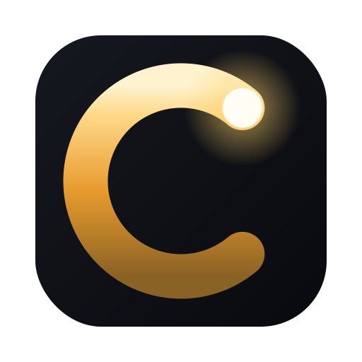
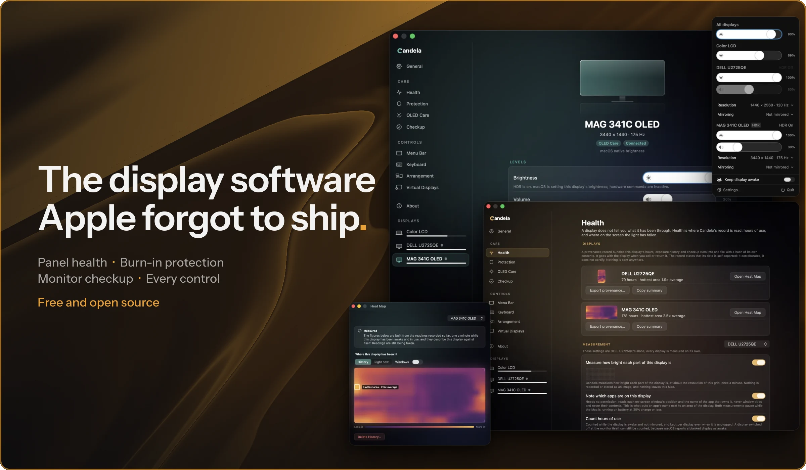
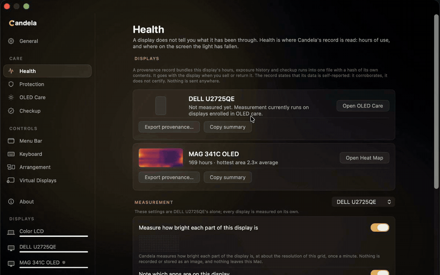
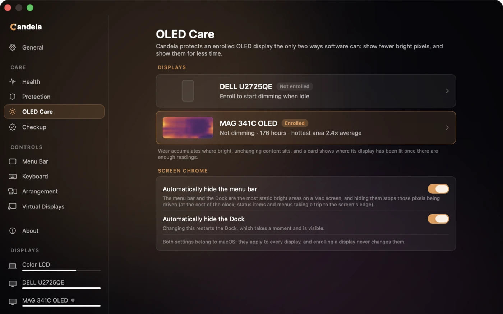
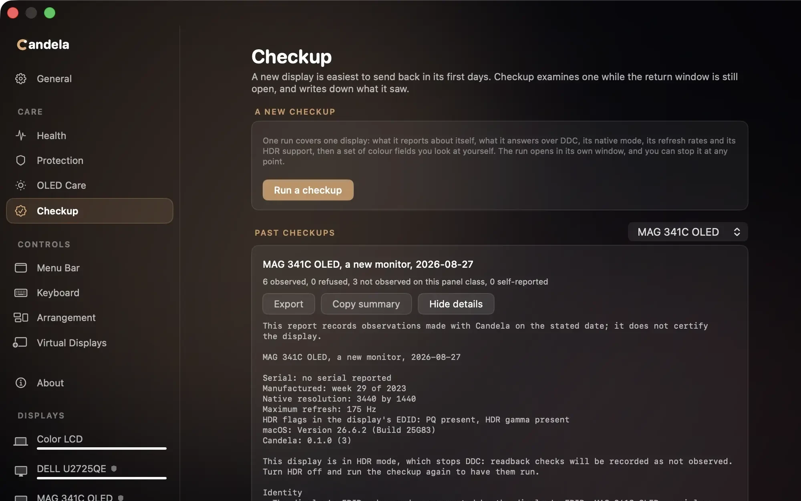
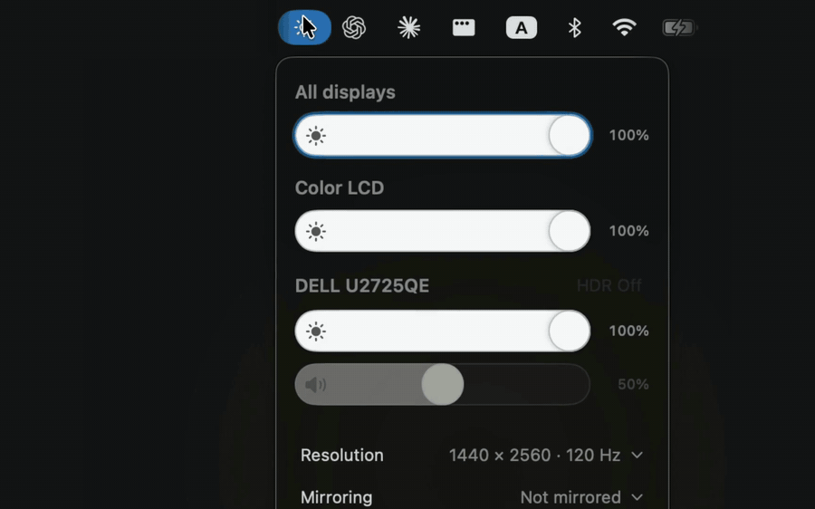
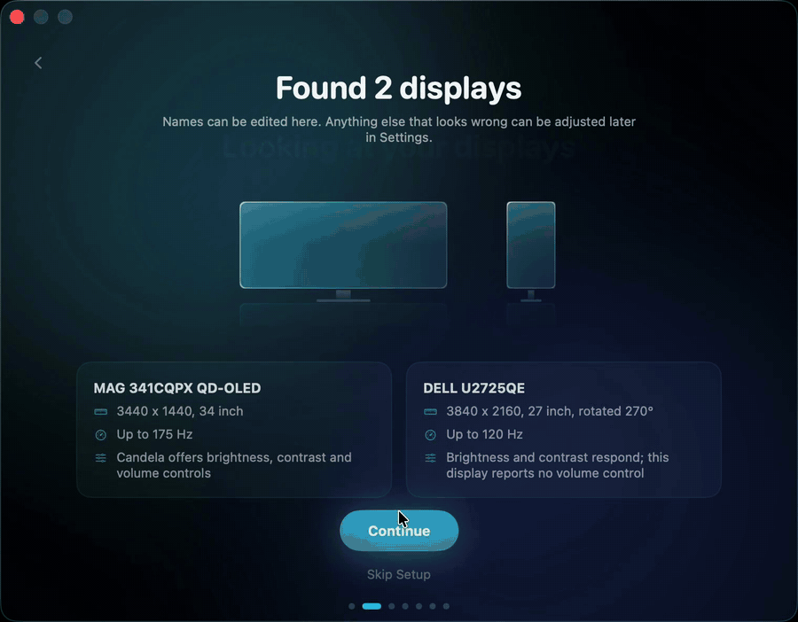

<p align="center">
  
</p>

<h1 align="center">Candela</h1>

<p align="center">
  <b>Candela looks after your displays.</b><br>
  Panel health, burn-in protection, a checkup for defects and wear, and the everyday controls macOS leaves out.<br>
  Free and open source, for macOS.
</p>

<p align="center">
  <a href="https://candela.fyi/download?placement=readme"></a>
  &nbsp;
  <a href="#install"></a>
  &nbsp;
  <a href="https://candela.fyi"></a>
</p>

<p align="center">
  
  
  
  <a href="LICENSE"></a>
</p>

<p align="center">
  
</p>

Other display apps adjust settings in the moment. Candela protects your panel over the years you own it: adaptive, real-time burn-in defense, a health record of the hours and light the panel has seen, and settings that survive sleep and replugs. A diagnostic checkup identifies defects and wear on any display, alongside a full suite of monitor controls that should have been built into macOS in the first place.

## What it does

<table>
  <tr>
    <td width="50%" valign="top">
      
      <h3>Health</h3>
      A map of where an enrolled panel has been lit, kept as a coarse grid so nothing on your screen is stored. Turn on measurement and it fills in from real readings. Panel hours and per-app time come with it, and the whole record exports as one integrity-checked file.
    </td>
    <td width="50%" valign="top">
      
      <h3>Protection</h3>
      Adaptive, real-time burn-in defense: Candela watches what the screen is showing and eases down bright regions that sit unchanged, while live content stays at full brightness. Alongside it, one-click auto-hide for the menu bar and Dock, dimming when you step away or lock the Mac, and display settings that survive replugs and reboots.
    </td>
  </tr>
  <tr>
    <td width="50%" valign="top">
      
      <h3>Checkup</h3>
      A guided diagnostic for any display, new or years in: it looks for defects and wear, checks what the monitor claims against what it does, and ends in a report you keep. Every result is graded (observed, refused, not observed, self-reported).
    </td>
    <td width="50%" valign="top">
      
      <h3>Controls</h3>
      Brightness, contrast and volume for external displays over DDC/CI, from the menu bar, media keys and a HUD. Software dimming below the hardware floor, an HDR toggle, every resolution the panel can show including HiDPI sizes macOS hides, plus arrangement, mirroring, rotation and virtual displays.
    </td>
  </tr>
</table>

<br>

<p align="center">
  
</p>

<p align="center"><b>It configures itself to your setup.</b> On first launch Candela finds every display, asks each what it can do, and builds the controls around the answers; a sharper size is offered where the panel supports one.</p>

## Install

Download the notarized build from [the latest release](https://github.com/Rydersel/Candela/releases/latest) or [candela.fyi](https://candela.fyi), open the disk image, and drag Candela to Applications. Or with Homebrew:

```sh
brew install --cask rydersel/tap/candela
```

Candela checks for updates on its own and asks before installing one. Updates are signed, and a build whose signature does not match is refused.

## Requirements

- macOS 14 or later, on Apple silicon.
- For hardware brightness, contrast and volume: a monitor that supports DDC/CI over the cable you are using. Most do. Write-only panels, which accept writes but answer every read with zeros, are supported and tracked by the last value sent.
- **Accessibility**, only if you want the keyboard media keys to drive an external display.
- **Screen Recording**, only if you opt into measured exposure sampling. Nothing else asks for it.

## A note on private APIs

Some features (mode switching, virtual displays, the HDR toggle, menu-bar auto-hide) use macOS interfaces Apple does not document. They are what other tools cannot offer, and they can break when a new macOS ships. A built-in conformance check detects that, and fixes land in the open.

## Tested hardware

Every release is tested on as many different displays, connections and Macs as we can get our hands on, but no two setups are alike. If something misbehaves on yours, [open an issue](https://github.com/Rydersel/Candela/issues/new/choose) with your Mac, macOS version, monitor model and how it is connected, and we will look at it as soon as we can. A working setup is worth reporting too: it goes into the [tested hardware table](docs/HARDWARE.md).

## Documentation

- [User guides](docs/guide/index.md): OLED care, checkup, resolutions, the Diagnostics page, and advanced settings.
- [Advanced settings](docs/ADVANCED-SETTINGS.md): the `defaults write` keys behind the escape hatches.
- [Tested hardware](docs/HARDWARE.md): the monitors, connections and Macs Candela has been used on, one row per report.
- [Contributing](CONTRIBUTING.md): building from source, running the suites, and what a change is expected to state about its own verification.

## Credits

- [MonitorControl](https://github.com/MonitorControl/MonitorControl): parts of the display-control engine, adapted under the MIT license. Details in [THIRD-PARTY-LICENSES.md](THIRD-PARTY-LICENSES.md).
- [Sparkle](https://sparkle-project.org): in-app updates.
- [KeyboardShortcuts](https://github.com/sindresorhus/KeyboardShortcuts): the shortcut recorder.

## License

[MIT](LICENSE).
