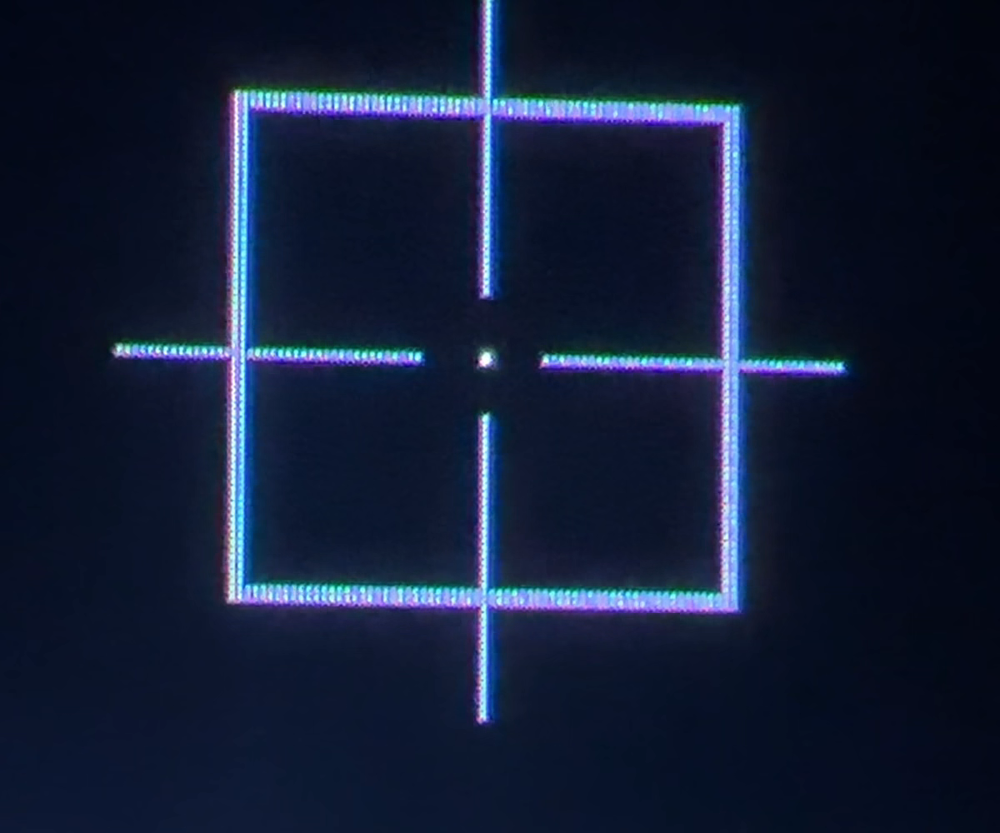
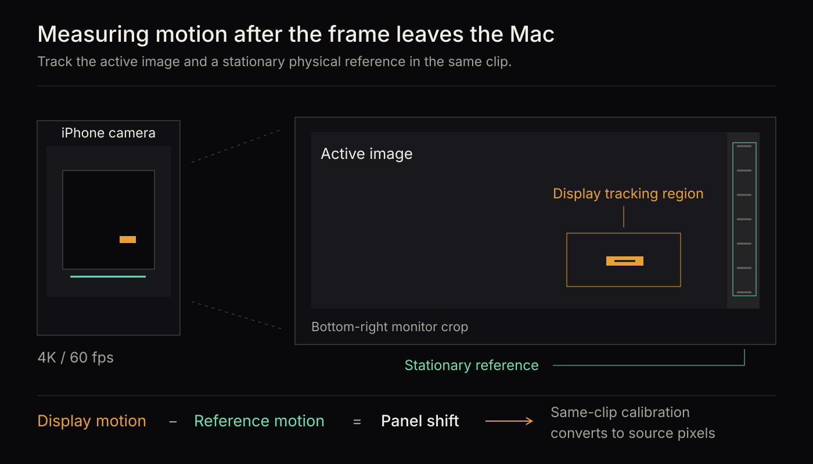

# Measuring the monitor's pixel movement

[Evidence index](README.md) · Physical measurement · Captured September 10, 2026

## Finding

With Pixel Shift set to Fast, the tested MSI MAG 341CQP moved its image through 43 resolved positions during a 41-minute, 50-second measurement phase. The 42 relocations followed a one-source-pixel lattice. The 41 complete intervals between relocations averaged 60.134 seconds in the camera timebase.

The measurement observes image geometry after the video signal reaches the display. It does not observe detector maps, electrical compensation or burn-in.

## Setup

| Component | Configuration |
| --- | --- |
| Display | MSI MAG 341CQP; firmware 041; panel `QMC340CC01-D01` |
| Video signal | Native 3440 × 1440, fixed 60 Hz, SDR, brightness 50% |
| Pixel Shift | Enabled, Fast, selector 2 |
| Other host behavior | Candela OLED Care enrollment, display sleep and screen saver disabled for the run |
| Camera | iPhone 17 Pro; recorded 3840 × 2160 HEVC |
| Recording length | 43 minutes, 17.565 seconds |
| Measurement window | Recording time 87.573333 seconds through 2597.565 seconds |

Fixed refresh was used, so VRR was expected to be off; the recording does not independently certify that state. Camera metadata identifies the capture format and lens but does not establish locked focus, exposure or disabled stabilization.

The stimulus was a single white source pixel at `(3312, 1312)` on a black background. The setup phase added a square with a known separation of 65 source pixels and a crosshair. Setup and measurement occurred in one continuous recording, with desktop handoff intervals excluded from analysis.



*Recorded calibration imagery. The measurement phase retained the central point and removed the surrounding target. The crop has no plotted trace overlay.*

## Method

A host screenshot cannot see panel-side pixel shifting. The camera records both the active image and stationary physical structure outside it, providing a reference for separating image motion from camera motion.



1. Fit the calibration square in 111 setup samples. Divide the opposing-edge separations by 65 to obtain the camera-to-source-pixel basis.
2. Locate candidate relocations from the luminous point's position over time.
3. Measure the point before and after each relocation, using native-frame windows around the transition.
4. Independently register the stationary scene before and after the same transition. Subtract that apparent reference motion from the point motion.
5. Convert the corrected displacement into source-pixel units, then round once to decode the integer step. Accumulate the steps into relative positions.

The fitted positive-x basis is `(9.083365, 0.214725)` camera pixels per source pixel. Positive y is `(-0.064486, 9.069918)`. These axes were fixed by calibration, not selected to improve agreement with a vendor table.

Stationary-reference correction preserves all 42 decoded integer steps. The worst corrected rounding residual is 0.303 source pixel; the minimum reference-registration correlation is 0.991710. These checks support the decoded path, while the undocumented camera stabilization and use of natural scene structure remain acquisition limitations.

## Timing and uncertainty

| Measure | Result |
| --- | ---: |
| Resolved positions | 43 |
| Relocations | 42 |
| Complete transition-to-transition intervals | 41 |
| Mean interval | 60.134 seconds |
| Minimum interval | 60.118 seconds |
| Maximum interval | 60.153 seconds |
| Sample standard deviation | 0.012 seconds |

The first and last partial plateaus are not counted as complete intervals. A transition timestamp identifies the first partially changed frame under the extraction rule, rather than the exact instant the panel's internal timer fired. The comparison manifest assigns ±33,334 microseconds per timestamp, covering two nominal camera frames.

These figures describe apparent timing in this recording. They should not be interpreted as an independently calibrated measurement of the monitor's oscillator accuracy.

## Measured positions

The coordinates below are decoded optical observations relative to the first position. Positive y follows the analysis convention. The article's illustrative video mirrors its camera crop vertically to match the chart; the measurements themselves are unchanged.

| Position | Recording time, seconds | x, source pixels | y, source pixels |
| ---: | ---: | ---: | ---: |
| 1 | 87.573 | 0 | 0 |
| 2 | 119.068 | 0 | 1 |
| 3 | 179.222 | -1 | 1 |
| 4 | 239.357 | -1 | 2 |
| 5 | 299.475 | -2 | 2 |

[Download all 43 positions](data/positions.csv). The [orbit comparison](orbit-comparison.md) explains what this path establishes.

## Data and reproduction limits

| Supplement | Contents |
| --- | --- |
| [Decoded observations](data/observations.jsonl) | Ordered records used by the comparator; position records have quality `decoded` |
| [Transition measurements](data/transition-measurements.csv) | Camera centroids, reference corrections, unrounded and decoded steps, residuals and timestamps |
| [Setup calibration](data/setup-calibration.csv) | The individual calibration fits |
| [Reference registration](data/reference-transition-windows.csv) | Independent stationary-scene measurements around each relocation |
| [Setup target](data/setup.svg) and [measurement target](data/capture.svg) | Exact source stimuli, at native source dimensions |
| [Capture manifest](data/capture.json) | Device identification, fixed axes and time uncertainty for replay |

The transition table's `*_camera_px` columns use camera pixels; `*_source_px` columns use source pixels. `detector_time_s` and `settled_time_s` refer to the original recording timeline. `cumulative_x_source_px` and `cumulative_y_source_px` are the resulting relative positions. Values are preserved at their original precision; the rounded figures in this report are for reading.

The [orbit report](orbit-comparison.md#reproduce-the-primary-comparison) provides a command that replays the table comparison using this public capture manifest and independently supplied Samsung archives. It compares published measurements; it does not re-extract them from footage.

The original `IMG_0275.MOV` is 4,590,168,396 bytes and is not distributed in this appendix. Its SHA-256 is:

```text
1601dd1f2d69fe17d6783bcd953294a8e10652a6407a58b22808ba4a5c284976
```

Re-running image tracking requires that recording, or a new acquisition using the published setup and procedure. The stimulus and data make the experiment inspectable, but the absent footage limits independent verification of the entire acquisition chain. File hashes establish byte identity, not physical provenance.
