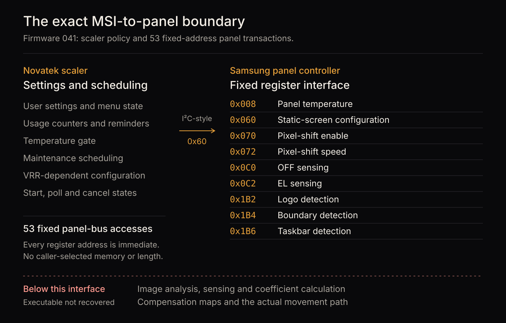

# The MSI firmware boundary

[Evidence index](README.md) · Firmware analysis and device readback · September 11, 2026

## Finding

The MAG 341CQP's firmware update explains how MSI configures and schedules OLED Care. It does not contain the Samsung panel controller's executable, image detectors or electrical compensation calculations.

This distinction limits what can be concluded from the update: a command that enables taskbar detection identifies an interface, not the algorithm behind it.



## Device and material examined

| Item | Identification |
| --- | --- |
| Monitor | MSI MAG 341CQP, 34-inch QD-OLED |
| Scaler firmware | 041 |
| Panel identifier returned by the monitor | `SDC QMC340CC01_D01` |
| Controller version returned by the monitor | `V70` |
| Firmware source | [MSI product support](https://www.msi.com/Monitor/MAG-341CQP-QD-OLED/support#firmware) |

SHA-256 of the analyzed firmware 041 image:

```text
69b75a1b67652a0fcfb20bda8de958a203784d70111a76740380b29fc7ebda59
```

Static analysis accounted for the populated firmware partitions and traced the OLED Care setting handlers to their panel transactions. Device readback separately confirmed the reported identities and configured settings. Readback does not expose internal detector state.

## What the update exposes

The analyzed image contains 53 recovered transactions to the panel controller at bus address `0x60`. Each uses a fixed register address. No general panel-memory read was found among those transactions.

| Register | Recovered role | What remains unknown |
| --- | --- | --- |
| `0x008` | Panel temperature input to maintenance policy | Sensor location and internal thermal control |
| `0x060` | Static-screen configuration | The panel's image classifier and dimming response |
| `0x070`, `0x072` | Pixel-shift enable and speed selection | Complete private orbit and implementation |
| `0x1B2` | Logo detection configuration | Detected regions and gain calculations |
| `0x1B4` | Boundary/pillar detection configuration | Detector state and regional processing |
| `0x1B6` | Taskbar detection configuration | Detector state and regional processing |
| `0x0C0` | OFF-sensing maintenance control | Electrical measurements and compensation-map updates |
| `0x0C2` | EL-sensing control in a latent sequence | Panel-side sensing implementation |

The scaler owns eligibility, temperature gates, completion polling and settings policy, including VRR-dependent suppression of regional controls. The longer EL sequence exists in the analyzed code but has no identified entry in the shipped control flow of the four examined releases. Its presence is not evidence that users can invoke it as an ordinary feature.

These are analysis results, not instructions for sending commands to a monitor.

## Independent readback

The monitor reported firmware 041, controller V70, the panel identifier above, Pixel Shift set to Fast and the regional protection settings enabled. These replies corroborate the recovered configuration interface. A setting reported as enabled does not establish that a detector is active on a particular frame or reveal the regions it has selected.

An earlier failure to obtain DDC replies was traced to an incorrect request checksum. Corrected reads worked repeatedly. The earlier interpretation that this monitor was write-only was therefore withdrawn.

## Scope of the negative result

The investigation checked the MSI update partitions, recovered public command tables and related vendor/source packages. It found neither an embedded panel executable nor a documented external memory-read route to the Samsung controller.

This is a bounded negative result. It does not establish that no service interface exists. A matching service image, fuller source release or independently identified controller dump could change it. Encryption of a downloadable update package does not establish how this controller stores code internally.

Physical behavior can still be measured without recovering that code. The [camera report](camera-measurement.md) documents pixel movement; the [orbit report](orbit-comparison.md) compares that movement with published tables. Neither exposes the panel's electrical compensation internals.
