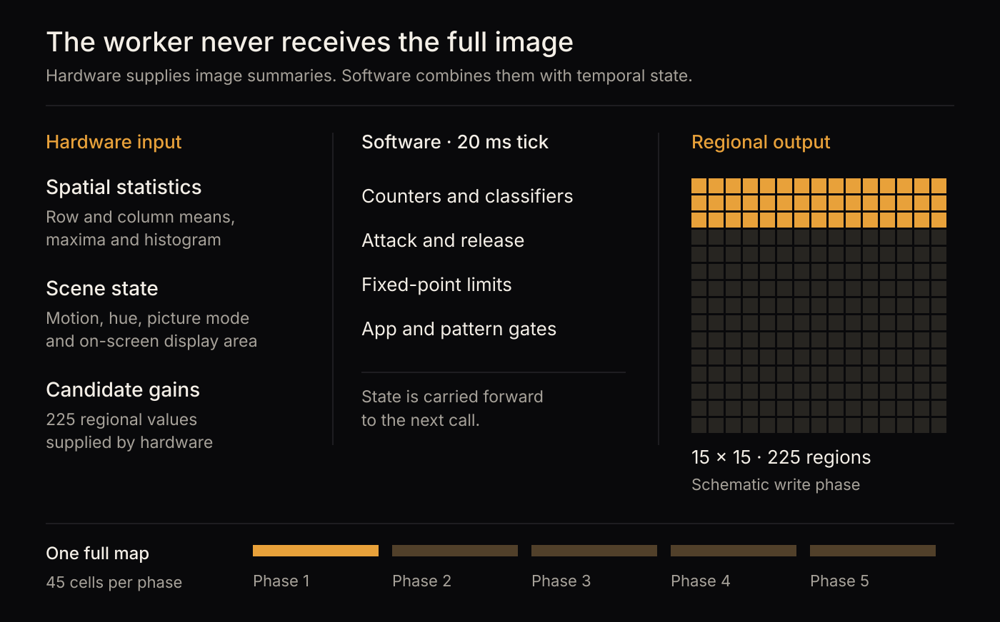

# Samsung source provenance

[Evidence index](README.md) · Published source analysis · September 11, 2026

These notes identify the public source behind the [guide](https://candela.fyi/guides/reverse-engineered-oled-monitor/) and simulator. PontusM is a Samsung Electronics TV and smart-monitor platform. These archives do not contain the executable running inside the MSI MAG 341CQP's Samsung Display panel controller.

## Obtain and identify the releases

Visit the [Samsung Open Source Release Center](https://opensource.samsung.com/uploadSearch), search for `PONTUSML`, and locate the release records below. The names are the archive filenames used for this investigation; the 2022 record uses `PontusM` in its filename.

| Release | Record ID | Archive | QD algorithm version |
| --- | --- | --- | --- |
| 2022 Smart Monitor | 10695 | `22_SmartMonitor_PontusM.zip` | 18 |
| 2023 DTV | 11282 | `23_DTV_PontusML.zip` | 20 |
| 2024 DTV | 12129 | `QNxxS95DAFXZA.zip` | 22 |

The outer archive SHA-256 values are:

```text
2022  057d43ac370eefc4ad4a5d0db9b2c148cb2144c9cc7e8313bcc3cdfda7b5fbb6
2023  203116537c27d4368dee1e22a7fa5c88a11d727cdda3e024785ce80d4601bee7
2024  517d29ac88ad5932871a5f4b4fb3f91bb410aae2af89b62d44a53b4decd0db19
```

The simulator's [source registry](../../../tools/pontusm-sim/pontusm_sim/source.py) also pins nested archive and individual source-file hashes. Follow the [README's verification commands](../../../tools/pontusm-sim/README.md#commands) to check your copies. A successful hash check establishes which source was supplied, not that the simulator reproduces every behavior correctly.



## Locate the code

For 2022, open the nested `22_SmartMonitor_PontusM.zip`, then `tztv-media-oscarp_pontusm.zip`. The relevant member paths end in:

```text
tztv-media-sec/sdp_pqe_frc/frc/pontusm/QD_burn_in.c
tztv-media-sec/sdp_pqe_dp/dp/pontusm/bip_orbit_table.h
```

For 2023, the nested archive is `23_DTV_PontusML/tztv-media-sec.tgz`. For 2024 it is `QNxxS95DAFXZA/tztv-media-sec.tgz`. Both contain:

```text
tztv-media-sec/sdp_pqe_frc/pontusm/QD_burn_in.c
tztv-media-sec/sdp_pqe_dp/pontusm/sdp_pqe_bip.c
tztv-media-sec/sdp_pqe_dp/pontusm/bip_orbit_table.c
```

The excerpts below are from the unmodified archive members. Line numbers count from the first line; displayed whitespace is normalized. Source ownership remains with its authors. The archives are obtained separately from Samsung, not redistributed here.

## 2023 retention counter

In the version-20 `QD_burn_in.c`, lines 2343–2345 increment and saturate the counter, then arm the curve at count 3,500:

```c
uLD_fcn_cnt = (uLD_fcn_cnt < 3500) ? uLD_fcn_cnt + 1 : 3500;

if (uLD_fcn_cnt > (3500 - 1)) uLD_fcn_on = 1;
```

The enclosing condition at line 2341 is `if (uLD_RETENTION_PATT > 0)`. This is not an unconditional timer; inspect the full function, including its reset path, when reproducing it. At the nominal 20 ms worker interval, 3,500 consecutive asserted ticks take 70 seconds. The curve operates on digital codes; its full-scale output ratio is not a measured luminance ratio.

The same file's lines 2209 and 2217 label retention-dependent ISP and screen-saver exclusions with the comment `// Rtings Retention`. The comment names a test context. It does not by itself establish deceptive benchmark behavior or tell us which settings the MSI uses.

Version 20 also contains `QD_CNN_DETECTION`, which examines lower-screen image statistics and temporal history. The visible function uses thresholds and counters rather than a model-inference call. That observation says nothing conclusive about unpublished upstream processing.

## 2024 pipeline change

Version 22's worker has these calls commented out at lines 462–463:

```c
// QD_RETENTION_DETECT(LD_BASE_ADDR);
// QD_FCN_CURVE_CTRL(LD_BASE_ADDR, uLD_BLK_DB_SEL);
```

The retired function bodies remain in comments. The active worker instead consumes 225 hardware-generated candidate coefficients through the `24Y_SRP` path and applies revised local processing. Changes include the normal-pattern knee, fixed-point rounding, dark-image strength reduction, factory exclusions and local masks. The published code does not contain the generator of the candidate map.

The version-22 `QD_burn_in.c` SHA-256 is:

```text
dee42f7fa33a9ae7b5a2f128fc2f34047d01cd3e4e95f1fa4db60a6c0613cf1a
```

The [controlled v20/v22 scenario](simulator-comparison.md) compares the reconstructed logic using the same supplied candidate map. It does not predict the MSI panel's output.

## Pixel-shift comparison

All three releases contain the same 1,956-position normal orbit, spanning ±16 pixels. The 2023 and 2024 orbit-source files are byte-identical. Their SHA-256 is:

```text
4ba52025214749c27fc7475ed6765fcb0cc17b0c779e4e3aa7dd1850476d9b7b
```

The [camera measurement report](camera-measurement.md) supplies decoded MSI positions and records the distinction between the original footage, derived measurements and rendered illustrations. The source registry checks official table identity before the simulator uses those tables for comparison.
