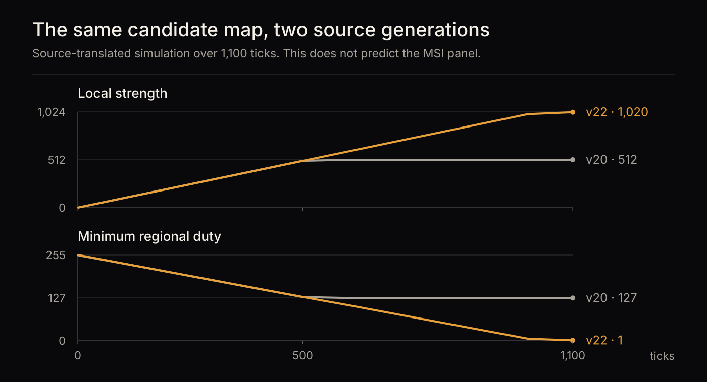

# Comparing two generations of protection logic

[Evidence index](README.md) · Controlled software simulation · September 11, 2026

## Finding

Under the same synthetic input, the reconstructed PontusM v20 and v22 algorithms produce different regional limits. At tick 1,100, v20 has reached local strength 512 with minimum regional duty 127. Version 22 reaches strength 1,020 with minimum duty 1.

These are internal digital quantities from a software model. They are not measured brightness, panel wear or the MSI monitor's output.



## What is being simulated

The [Python implementation](../../../tools/pontusm-sim/README.md) reconstructs the published integer operations, counters and state transitions from three [identified Samsung releases](samsung-source.md). It models the 225-region map, global-curve state, banner policy and pixel-shift index advancement. An additional module reconstructs MSI scaler maintenance policy.

Hardware-generated values are explicit scenario inputs. In particular, the simulator does not calculate the unpublished 2024 SRP candidate map. It also does not emulate the MSI panel executable or electrical compensation.

| Evidence class | Meaning in this comparison |
| --- | --- |
| Published logic | Integer operations, constants and temporal transitions translated from identified source |
| Supplied input | Image summaries and candidate regional gains that real hardware would produce |
| Unavailable | Candidate-map generator, exact MSI panel code and OFF/EL sensing calculations |

## Experimental input

The [version-delta scenario](../../../tools/pontusm-sim/scenarios/v22-local-delta.json) has four phases totaling 1,220 ticks. Both releases receive the same inputs for each phase.

| Phase | Duration | Purpose |
| --- | ---: | --- |
| Pattern knee | 1,100 ticks | Compare the normal-pattern threshold and accumulated local strength |
| Dark image | 10 ticks | Compare dark-image target handling |
| High menu / LPC | 40 ticks | Exercise menu strength and local-mask shaping |
| Factory exclusion | 70 ticks | Exercise v22's factory-mode exclusion and recovery |

For the first phase, row and column means are 100, maxima are 150, every candidate regional gain is zero, pattern probability is 769, image mean is 256, motion is false and logo brightness is Low. These values are a controlled stimulus, not statistics extracted from the camera recording.

The simulator records periodic checkpoints and phase boundaries. The chart shows the first phase. The downloadable tables retain the subsequent phases as well.

## Results

| Quantity at tick 1,100 | Version 20 | Version 22 |
| --- | ---: | ---: |
| Local target strength | 512 | 1,020 |
| Accumulated local strength | 512 | 1,020 |
| Minimum regional duty | 127 | 1 |

The comparison records 120 differences across its saved checkpoints, including availability flags and scalar fields. That count describes the report's coverage; it is not a confidence score or 120 independent experiments.

The result demonstrates why the phrase “Samsung's algorithm” is too broad without a release identifier. It does not establish which implementation runs inside the MSI.

## Reproduce

From the repository root, with Python 3.11 or newer:

```sh
export PYTHONPATH=tools/pontusm-sim
python3 -m pontusm_sim compare \
  tools/pontusm-sim/scenarios/v22-local-delta.json \
  --from-version 20 --to-version 22 \
  --output /tmp/oled-version-comparison
```

Use a destination that does not already exist. The comparison produces per-version traces, summaries and a combined report. This scenario runs without downloading vendor archives; source verification is a separate step described in the [source report](samsung-source.md).

The implementation's tests exercise reconstruction behavior. Passing tests alone cannot prove correspondence with hardware or rule out a shared mistake in a model and its expectations.

## Data supplement

- [Version 20 checkpoints](data/simulator-v20.csv)
- [Version 22 checkpoints](data/simulator-v22.csv)

`tick` identifies the simulated worker call, and `phase` identifies the stimulus. `local_target_strength` is the instantaneous target; `local_strength` is its temporally filtered state. `minimum_region_duty` is the lowest digital regional duty in that checkpoint. Availability flags distinguish retired paths from numerical zero. Empty fields mean the release does not provide that value.

The tables preserve the original saved values. Their hashes are recorded in the [publication manifest](data/provenance.json).
